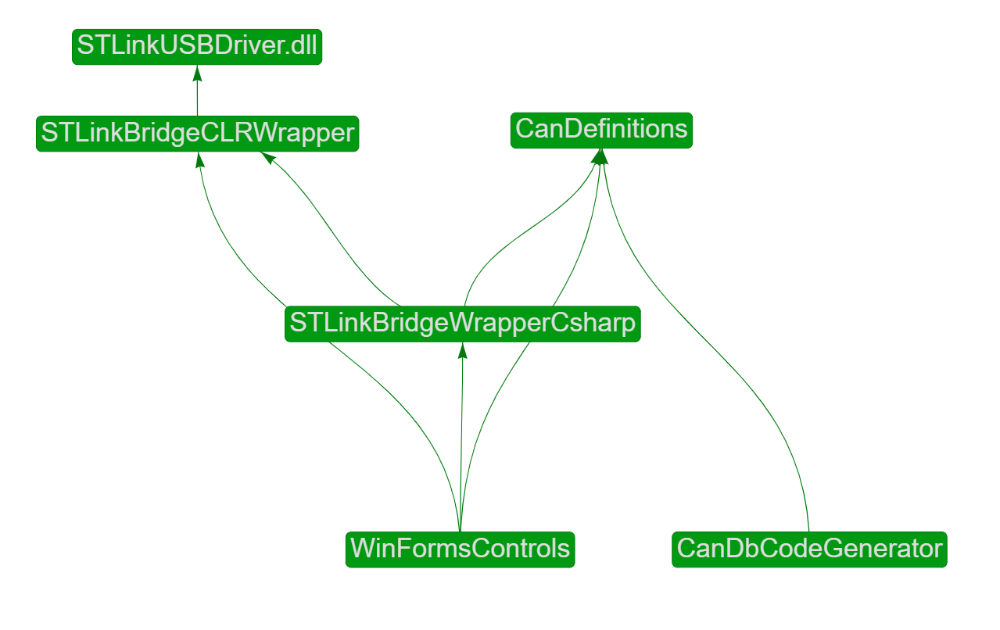

# ST-Link Bridge .NET Wrapper Tools

This project aims to provide an easy way to use the bridge functionality of the new V3 versions of the debuggers made by STMicroelectronics. The focus so far has been on providing good tools to implement CAN communication in a WinForms desktop application in a quick and effortless way. Effortless means that the programmer using these tools should not need to do any manual CAN message bit manipulation (but that certainly is possible if you want to). Quick means that the programmer should not need to set up and tune lots of low level parameters. So far only the CAN communication has been implemented. The remaining functionality (SPI, I2C, etc) has not yet been implemented. 

There are a number of tools needed to achieve the goal stated above. Following is a summary of the tools provided:

- **STLinkBridgeCLRWrapper** to provide a safe and easy way to use the bridge driver (STLinkUSBDriver.dll). Written in C++ with CLR extensions.
- **CanDefinitions** provides a basic set of useful CAN-related definitions. 
- **STLinkBridgeWrapperCsharp** extends STLinkBridgeCLRWrapper with more features (that don't need to be handled in C++) and provides additional abstraction.
- **WinFormsControls** implements all of the above and exposes it in a nice to use GUI component.
- **CanDbCodeGenerator** is useful for parsing .dbc files and generating static definitions in form of C# code for use in other projects that are dependent on the above projects. Use of this component is completely optional.

***

## Usage
See the **CSharpTest** project for an example of how to use the code.

## Dependencies
- STLinkUSBDriver.dll
- .NET framework 4.7.2
